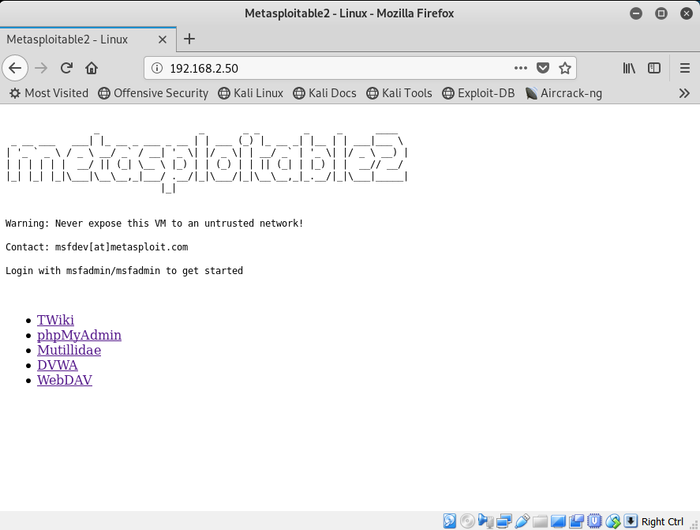
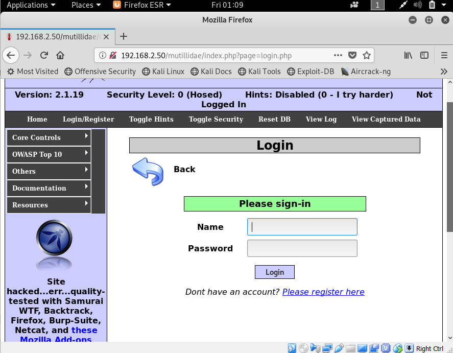
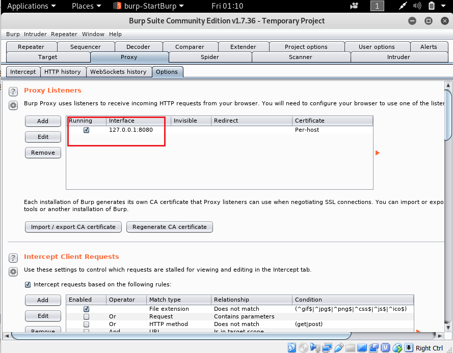

= SQL Injection with SQLmap
Author: Jake Kirsten

== Intro

We are going to be attacking a database with an SQL injection to retrieve passwords, and root access.

== Prerequisites

* Kali
* Metasploitable 2

== Setup

. turn on metasploitable and kali linux
. set the IP address on metasploit to 192.168.2.50/24
+
```
sudo ifconfig eth0 192.168.2.50 netmask 255.255.255.0
```
. Set the IP address on Kali Linux to 192.168.2.10/24 in settings or through the command line as shown:
+
```
sudo ifconfig 192.168.2.10 netmask 255.255.255.0
```
+
image::KaliIP.png[]
. Verify metasploitable 2 is running by going to 192.168.2.50 with firefox in Kali:
+

. Head over to the Mutillidae Login Page
+

. Minimize Firefox, but stay on the login page
. Open Burp Suite, and head over to the Proxy Tab and verify your settings match these:
+


== Instructions


